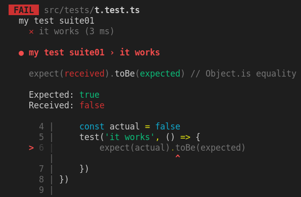

# Testing

<style>
:root {
    --r-heading1-size: 72px;
    --r-heading2-size: 48px;
}
pre {
  background: #303030;
  padding: 10px 16px;
  border-radius: 0.3em;
  counter-reset: line;
}
pre code[class*="="] .line {
  display: block;
  line-height: 1.8rem;
  font-size: 1em;
}
pre code[class*="="] .line:before {
  counter-increment: line;
  content: counter(line);
  display: inline-block;
  border-right: 3px solid #6ce26c;
  padding: 0 .5em;
  margin-right: .5em;
  color: #afafaf;
  width: 24px;
  text-align: right;
}

.reveal .slides > section > section {
  text-align:left; 
}

h1,h2,h3,h4 {
  text-align: center
}

p {
  text-align: center;
}

.present img {
    max-height: 65vh;
}
</style>

<script>

    window.onload = () => setTimeout(setLineNumber, 10)
    
    const setLineNumber = () => {
        const codeBlocks = document.querySelectorAll('pre code[class*="="]')
        codeBlocks.forEach(code => {
            const addLineSpan = code.innerHTML.trim().replaceAll('\n','</span><span class="line">')
            code.innerHTML = `<span class="line">${addLineSpan}</span>`    
        })
    }
    
</script>

---

# Yubin, Hsu

---

# Why test

--

Check

Quality

Confidence

--


--

# Why we write test

--

## Automation

--

## Documentation

how our code should work

--


--

How

---

# Golden Rule

--

design a test case to be

<div style="padding: 0 100px;">

- simple
- short
- abstraction-free
- flat
- delightful to work with

</div>

---

# The test

--

## test name

1. What is being tested?
2. What scenario?
3. What is the expected result?

--

```typescript=
// 1. unit under test
describe('Products Service', function() {
  describe('Add new product', function() {
    // 2. scenario and 3. expectation
    it('When no price is specified, then the product status is pending approval', ()=> {
      const newProduct = new ProductService().add(...);
      expect(newProduct.status).to.equal('pendingApproval');
    });
  });
});
```

--

## AAA pattern

--

Arrange

Act

Assert

--

```typescript=
describe("Customer classifier", () => {
  test("When customer spent more than 500$, should be classified as premium", () => {
    //Arrange
    const customerToClassify = { spent: 505, joined: new Date(), id: 1 };
    const DBStub = sinon.stub(dataAccess, "getCustomer").reply({ id: 1, classification: "regular" });

    //Act
    const receivedClassification = customerClassifier.classifyCustomer(customerToClassify);

    //Assert
    expect(receivedClassification).toMatch("premium");
  });
});
```

--

## Use product language

--

code the expectation in a human-like language

```typescript=
expect(myValue > 5).toBe(true)
expect(myValue).toBeGreaterThan(5) // better to read
```

https://jestjs.io/docs/expect#expectextendmatchers

--

## Test public methods

--

## Don't "foo", use real input data

--

## Make each test case independent

~~global test fixture~~

--

## No catch, expect them

```typescript=
it('should return 200 status code when call /api/todos API', async() => {
    try {
        const response = await axios.get('/api/todos')
        expect(response.status).toBe(200)
    } catch(error) {
        fail(`${error}`)
    }
})
```

↓

```typescript=
it(' should return 200 status code when call /api/todos API', async() => {
    const response = await axios.get('/api/todos')
    expect(response.status).toBe(200)
})
```

---

# Types of tests

- End-to-End, simulate user behavior
- Integration, multiple units work together
- Unit, single function/component
- Static, code typo or error

--


---

# TestPyramid


https://martinfowler.com/bliki/TestPyramid.html

---

# Choose a Test Framework

---

# Vitest

Blazing Fast Unit Test Framework

https://vitest.dev/

https://github.com/vitest-dev/vitest

--

## Vitest Install

```
npm install -D vitest
npm install -D @vitest/coverage-c8
```

--

## Vitest Config

create `vitest.config.ts`

```
import { defineConfig } from 'vitest/config'

export default defineConfig({
    test: {}
})
```

https://vitest.dev/config/

--

## npm script

```
"test": "vitest run --coverage"
```

--

## A Test

```typescript=
import { describe, test, expect } from 'vitest'

const expected = true
const actual = false

describe('my test suite01', () => {
    test('it works', () => {
        expect(actual).toBe(expected)
    })
})

```

--



--

```typescript
describe("API test", () => {
  it("should successfully get a pong string", () => {
    // Some testing condition
  });
  it("test B", () => {});
  it("test C", () => {});
  it("test D", () => {});
});
```


--

## Expect

https://vitest.dev/api/expect.html

```typescript
expect(1 + 2).toBeLessThan(4);
expect(1 + 2).toBeLessThanOrEqual(3);
expect(["A", "B", "C"]).toContain("B");
expect(1 + 2).not.toBe(4);
```

--

## Synchronous

```typescript
describe("Math test", () => {
  it("1 + 2 should be 3", () => {
    const a = 1;
    const b = 2;
    expect(a + b).toBe(3);
  });
});
```

--

## Asynchronous

```typescript
// pong.ts
async getPong(): Promise<string> {
    return new Promise((resolve) => {
        resolve('pong')
    })
}

// pong.spec.ts
describe('asynchronous test', () => {
    it('get pong', async () => {
        const result = await pong.getPong()
        expect(result).toBe('pong')
    })
    it('still get pong', async () => {
        await expect(pong.getPong()).resolves.toBe('pong')
    })
})
```

---

# Report

--

## Test Report


--

# Coverage Report


---

# Property Based Testing

Properties, Not Examples

--

# Fast Check


https://fast-check.dev/

--

```typescript=
import fc from 'fast-check'

describe('Product service', () => {
  describe('Adding new', () => {
    //this will run 100 times with different random properties
    it('Add new product with random yet valid properties, always successful', () =>
      fc.assert(
        fc.property(fc.integer(), fc.string(), (id, name) => {
          expect(addNewProduct(id, name).status).toEqual('approved')
        })
      ))
  })
})
```

---

# Snapshot Testing

--

Make sure the output of your functions does not change unexpectedly.

--

```typescript=
import { render } from '@testing-library/react'
import YourComponent from 'YourComponent'

it('The component UI should not change', () => {

  const comp = render(<YourComponent />)

  expect(comp).toMatchSnapshot()

})
```

---

# Contract testing

--

Contract testing is a methodology for ensuring that two separate systems (such as two microservices) are compatible and can communicate with one other.

--


https://docs.pact.io/

---

# Mutation Testing

--

Mutation testing introduces changes to your code, then runs your unit tests against the changed code.

--

## Stryker


https://stryker-mutator.io/

---

# Testing Library

--

## @testing-library/react

https://github.com/testing-library/react-testing-library

🐐 Simple and complete React DOM testing utilities that encourage good testing practices.

--

## @testing-library/user-event

https://github.com/testing-library/user-event

🐕 Simulate user events

--

```
import {render, screen} from '@testing-library/react'
import userEvent from '@testing-library/user-event'
import Fetch from './fetch'

test('loads and displays greeting', async () => {
  // arrange
  render(<Fetch url="/greeting" />)

  // act
  await userEvent.click(screen.getByText('Load Greeting'))
  await screen.findByRole('heading')

  // assert
  expect(screen.getByRole('heading')).toHaveTextContent('hello there')
  expect(screen.getByRole('button')).toBeDisabled()
})
```

https://testing-library.com/docs/react-testing-library/example-intro/#full-example

---

# Cypress

--

Cypress

https://github.com/cypress-io/cypress

Fast, easy and reliable testing for anything that runs in a browser.

--

[Writing Your First E2E Test ](https://docs.cypress.io/guides/end-to-end-testing/writing-your-first-end-to-end-test)

```javascript
describe("My First Test", () => {
  it("Gets, types and asserts", () => {
    cy.visit("https://example.cypress.io");

    cy.contains("type").click();

    // Should be on a new URL which
    // includes '/commands/actions'
    cy.url().should("include", "/commands/actions");

    // Get an input, type into it and verify
    // that the value has been updated
    cy.get(".action-email")
      .type("fake@email.com")
      .should("have.value", "fake@email.com");
  });
});
```

---


---

## Reference

[javascript-testing-best-practices](https://github.com/yubinTW/javascript-testing-best-practices/blob/master/readme-zh-TW.md)

---

Thx.
